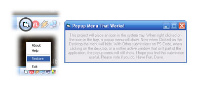



## System Tray Icon &amp; Popup Menu, That Works

### Description

This project will place an icon in the system tray. When right clicked on the icon in the tray, a popup menu will show. Now when Clicked on the Desktop the menu will hide. With Other submissions on PS Code, when clicking on the desktop, or another active window that isn't part of the application, the popup menu will still show. I hope you find this submission useful, Please vote if you do. Have Fun, Dave.
 
### More Info
 

             |
---                |---
**Submitted On**   |2006-04-16 07:20:02
**By**             |[Dave Nedved](https://github.com/Planet-Source-Code/PSCIndex/blob/master/ByAuthor/dave-nedved.md)
**Level**          |Beginner
**User Rating**    |5.0 (15 globes from 3 users)
**Compatibility**  |VB 6\.0
**Category**       |[Windows API Call/ Explanation](https://github.com/Planet-Source-Code/PSCIndex/blob/master/ByCategory/windows-api-call-explanation__1-39.md)
**World**          |[Visual Basic](https://github.com/Planet-Source-Code/PSCIndex/blob/master/ByWorld/visual-basic.md)
**Archive File**   |[System\_Tra1987454162006\.zip](https://github.com/Planet-Source-Code/dave-nedved-system-tray-icon-amp-popup-menu-that-works__1-65021/archive/master.zip)

